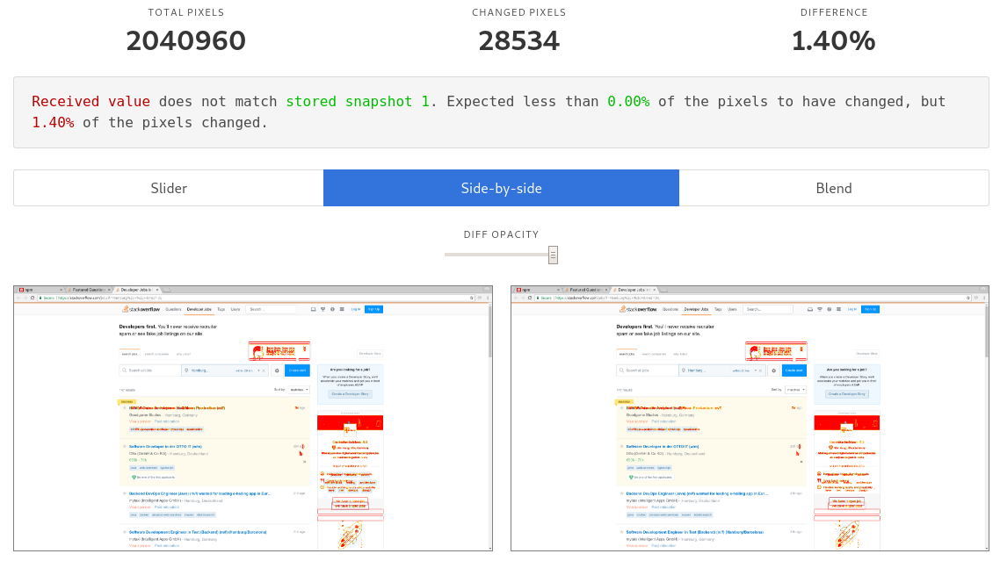
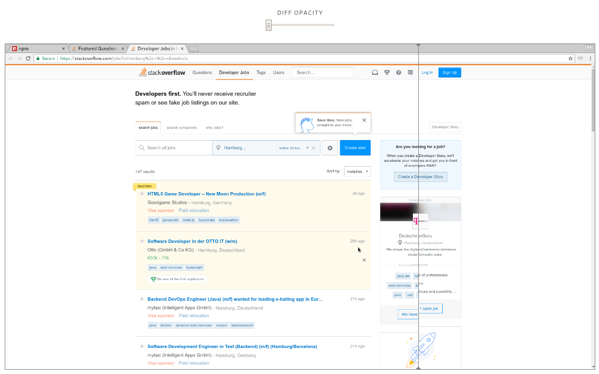

# jest-screenshot

[](https://www.npmjs.com/package/jest-screenshot)
[](https://travis-ci.org/Prior99/jest-screenshot)
[](https://coveralls.io/github/Prior99/jest-screenshot?branch=master)

A jest extension to deal with screenshots and all sorts of images. Inspired by the awesome [jest-image-snapshot](https://github.com/americanexpress/jest-image-snapshot) and
providing a mostly compatible API with similar features. By utilizing [native-image-diff](https://github.com/Prior99/native-image-diff) instead of [pixelmatch](https://github.com/mapbox/pixelmatch)
and [node-libpng](https://github.com/Prior99/node-libpng) instead of [pngjs](https://github.com/lukeapage/pngjs) the tests will run much faster than its competitor.

Please also refer to the **[Documentation](https://prior99.github.io/jest-screenshot/docs/index.html)**.

## Table of contents

 * [jest-screenshot](#jest-screenshot)
    * [Table of contents](#table-of-contents)
    * [Installation](#installation)
        * [Installing the expect extension](#installing-the-expect-extension)
        * [Installing the reporter](#installing-the-reporter)
        * [Configuring](#configuring)
            * [Example](#example)
    * [Usage](#usage)
    * [Reports](#reports)
    * [Contributing](#contributing)
    * [Contributors](#contributors)

## Installation

Two steps are necessary in order to use this plugin:

 1. Install the `expect().toMatchImageSnapshot()` extension. ([Here](#installing-the-expect-extension))
 2. Install the reporter. ([Here](#installing-the-reporter))

### Installing the expect extension

Integrate this plugin by calling `setupJestScreenshot` in the framework setup file:

```typescript
import { setupJestScreenshot } from "jest-screenshot";

setupJestScreenshot();
```

Store the above code in a `setup-framework.js` file and specify it when configuring Jest:

```json
"jest": {

    "setupTestFrameworkScriptFile": "<rootDir>/setup-framework.js"

}
```

### Installing the reporter

In order to generate the report, the reporter must be registered in the Jest configuration:

```json
"jest": {

    "reporters": [
        "default",
        "jest-screenshot/reporter"
    ]

}
```

### Configuring

By placing a file **jest-screenshot.json** in the root directory of your project with a [configuration object](https://prior99.github.io/jest-screenshot/docs/interfaces/jestscreenshotconfiguration.html)
you can configure it:

| Parameter                | type     | default                  | Description
|--------------------------|----------|--------------------------|-----------------------------------------|
| `detectAntialiasing`     | boolean  | `true`                   | Whether to attempt to detect antialiasing and ignore related changes when comparing both images. [See documentation](https://prior99.github.io/native-image-diff/docs/interfaces/diffimagesarguments.html#detectantialiasing). |
| `colorThreshold`         | number   | `0.1`                    | A number in the range from `0` to `1` describing how sensitive the comparison of two pixels should be. [See documentation](https://prior99.github.io/native-image-diff/docs/interfaces/diffimagesarguments.html#colorthreshold). |
| `pixelThresholdAbsolute` | number   | `undefined`              | If specified, **jest-screenshot** will fail if more than the specified pixels are different from the snapshot. |
| `pixelThresholdRelative` | number   | `0`                      | If specified, **jest-screenshot** will fail if more than the specified relative amount of pixels are different from the snapshot. When setting this to `0.5` for example, more than 50% of the pixels need to be different for the test to fail. |
| `snapshotsDir`           | string   | `__snapshots__`          | If specified, will change the directory into which the snapshot images will be stored, relative to the unit test file. |
| `reportDir`              | string   | `jest-screenshot-report` | If specified, will change the directory into which the HTML report will be written, relative to the project's root directory.  |
| `noReport`               | boolean  | `false`                  | Set this to `true` in order to completely disable the HTML report.  |

It's also possible to specify a key `jestScreenshot` in the **package.json** with the same interface.

All configuration options are optional.

If neither `pixelThresholdAbsolute` nor `pixelThresholdRelative` are specified, `pixelThresholdRelative` will be set to `0`.
Both can be specified together in order to make the test fail on both conditions.

#### Example

```json
{
    "detectAntialiasing": false,
    "colorThreshold": 0,
    "pixelThresholdAbsolute": 150,
    "pixelThresholdRelative": 0.5
};
```

The above config will make the tests fail if more than 150 pixels in total changed or more than 50% of the pixels changed.
It will detect any pixel as changed even if the color only differs minimally and antialiasing detection is disabled.

## Usage

Take a look at [the example project](example/).

Afterwards, it can be used to compare images with snapshots:

```typescript
describe("My fancy image", () => {
    const myFancyImage = readFileSync("../my-fancy-image.png");

    it("looks as beautiful as always", () => {
        expect(myFancyImage).toMatchImageSnapshot();
    });
});
```

This is for example useful for integration tests with [puppeteer](https://github.com/GoogleChrome/puppeteer):

```typescript
describe("My fancy webpage", () => {
    const page = ...; // Setup puppeteer.

    it("looks as gorgeous as ever", async () => {
        expect(await page.screenshot()).toMatchImageSnapshot();
    });
});
```

## Reports

An HTML report with interactive tools for comparing the failed snapshots will be generated if any tests failed.

**[A demo can be found here](https://prior99.github.io/jest-screenshot/report-demo).**

They might look for example like this:






The report will be placed in a `jest-screenshot-report` directory in the project's root directory by default.

## Contributing

Yarn is used instead of npm, so make sure it is installed. `npm install -g yarn`.

Generally, it should be enough to just run:

```
make
```

which will install all node dependencies, compile typescript, execute all test,
lint the sources and build the docs.

## Contributors

 - Frederick Gnodtke
